<div align="center">


# Echo Settings

Центр управления и системных настроек для Linux на базе Qt 6 / PySide6

[](https://github.com/dezaetterg/echo-settings/releases)
[](LICENSE)
[](https://github.com/dezaetterg/echo-settings)
[](https://www.qt.io/)
[](https://www.python.org/)

<br>

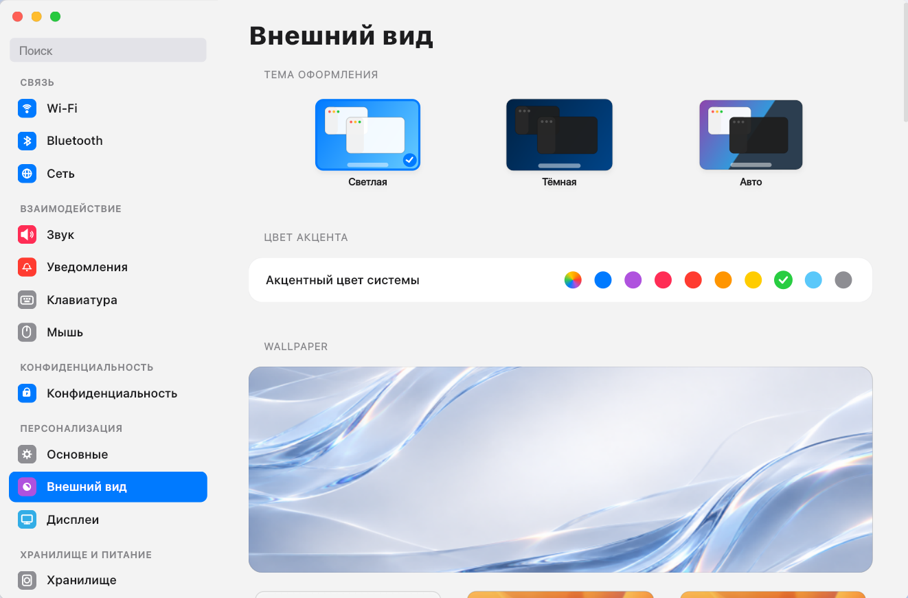

</div>

## Возможности

* **Оформление и темы**: переключение светлого и темного режимов, выбор акцентного цвета интерфейса, управление обоями рабочего стола с разделением на дневной и ночной варианты.
* **Дисплеи и экраны**: настройка разрешения, частоты обновления, масштабирования (HiDPI / Fractional scaling), расстановка мониторов перетаскиванием и режим Night Light.
* **Сеть и подключения**: управление Wi-Fi (сканирование, подключение, статус сигнала), проводные соединения Ethernet, VPN, прокси и сопряжение Bluetooth-устройств.
* **Звук**: регулировка громкости вывода и микрофона через PipeWire / PulseAudio, выбор активных звуковых устройств.
* **Электропитание**: переключение профилей энергопотребления (производительный, сбалансированный, энергосберегающий), мониторинг заряда батареи и таймауты отключения экрана.
* **Мышь и тачпад**: скорость указателя, ускорение, естественная прокрутка и базовые жесты.
* **Клавиатура**: переключение и добавление раскладок, настройка задержки повтора клавиш и хоткеев.
* **Конфиденциальность**: контроль системных разрешений для приложений (геолокация, камера, микрофон) и параметры блокировки экрана.
* **Хранилище**: просмотр занятого дискового пространства по категориям файлов и быстрая очистка кэша.
* **Уведомления**: глобальный режим «Не беспокоить» и выборочное отключение баннеров для отдельных программ.
* **Интеграция с Echo Search**: настройка внешнего вида, горячих клавиш и поисковых модулей лаунчера Echo Search.
* **Многоязычность**: полная локализация интерфейса на 13 языков с автоматическим определением языка системы.

## Скриншоты интерфейса

| Внешний вид и темы | Дисплеи и мониторы |
| :---: | :---: |
|  | 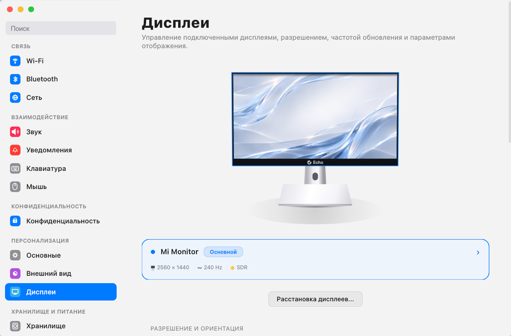 |
| **Сведения о системе (Основные)** | **Анализ хранилища дисков** |
| 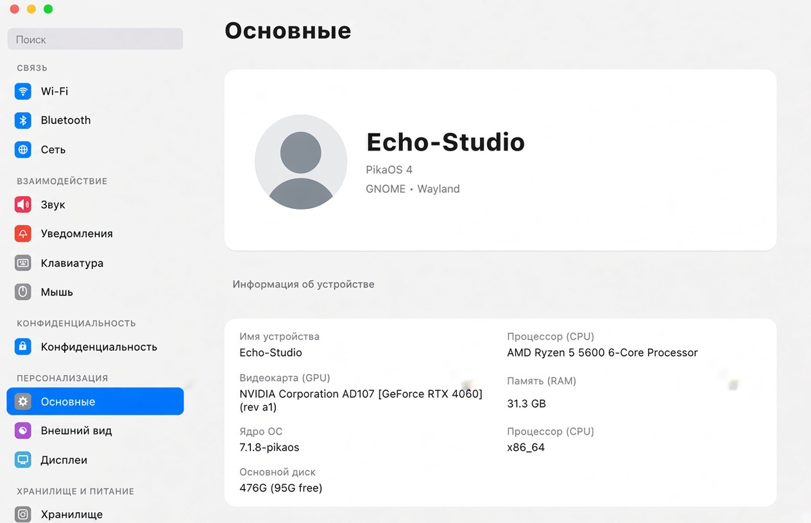 | 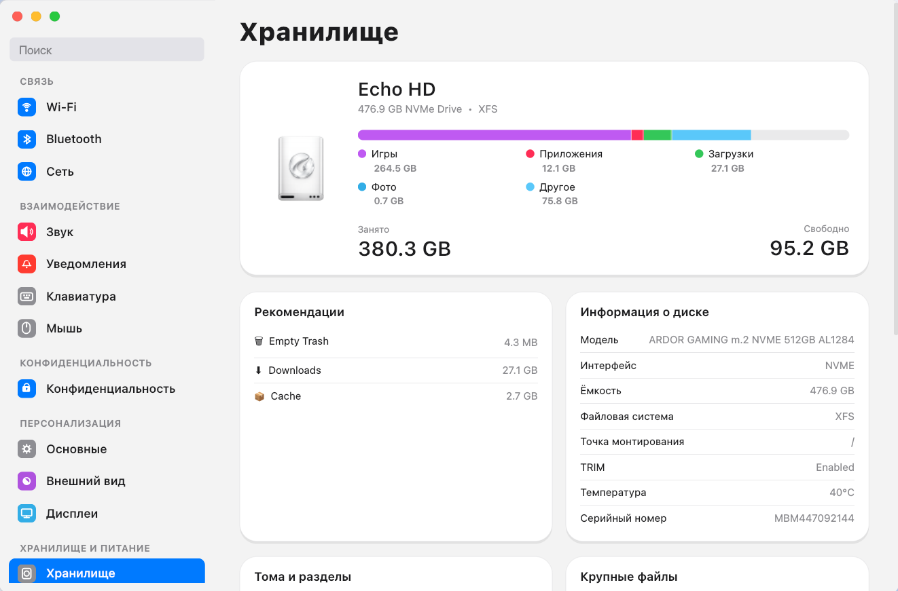 |
| **Беспроводная сеть Wi-Fi** | **Сетевые интерфейсы и VPN** |
| 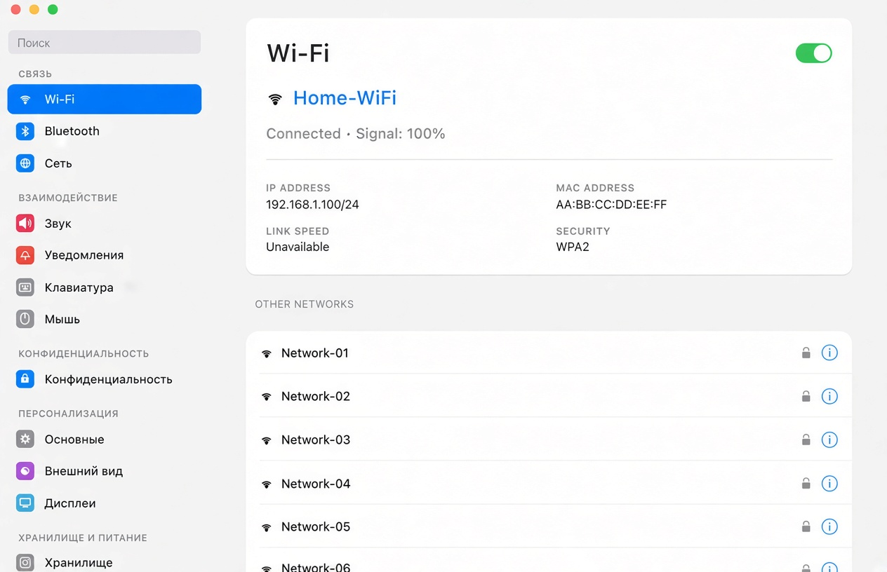 | 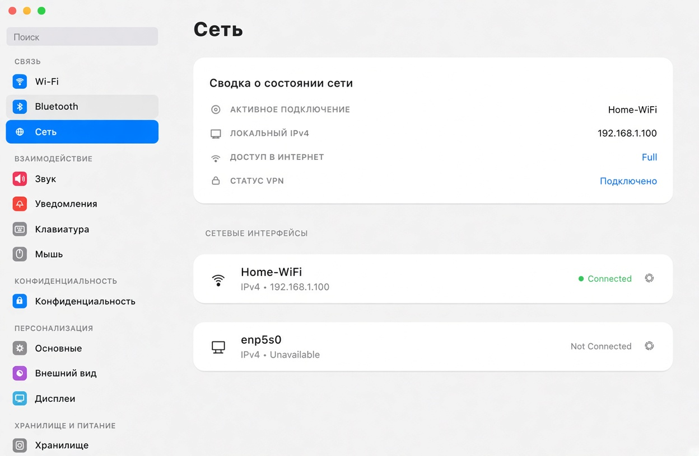 |
| **Bluetooth устройства** | **Звук и аудиоустройства** |
| 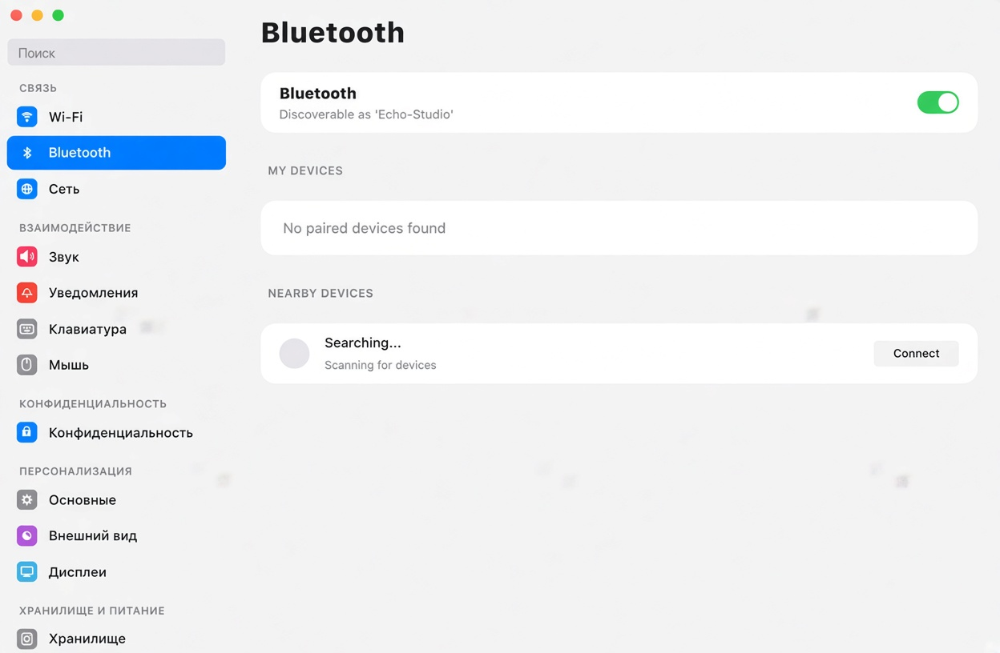 | 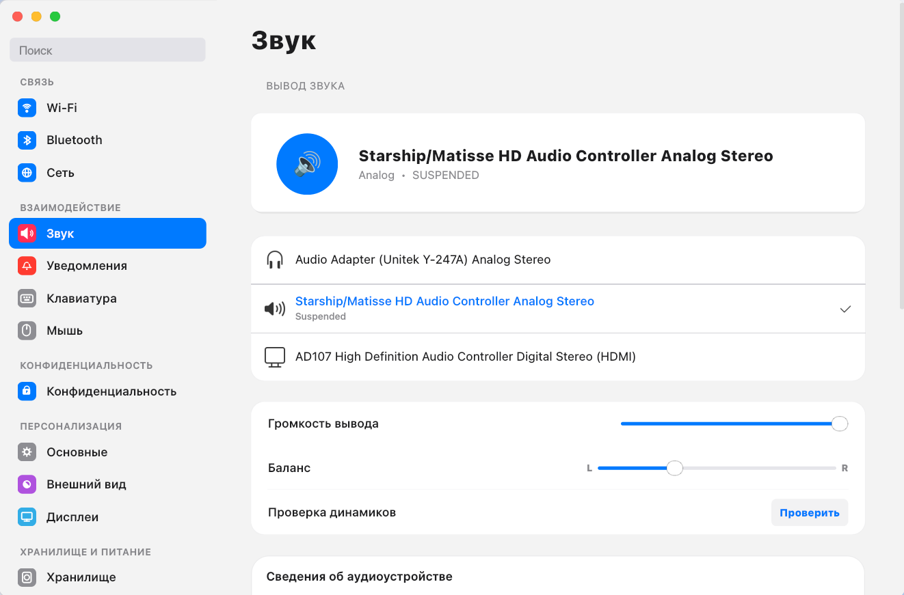 |
| **Уведомления приложений** | **Электропитание и батарея** |
| 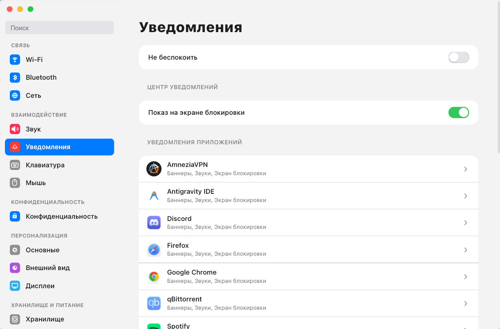 | 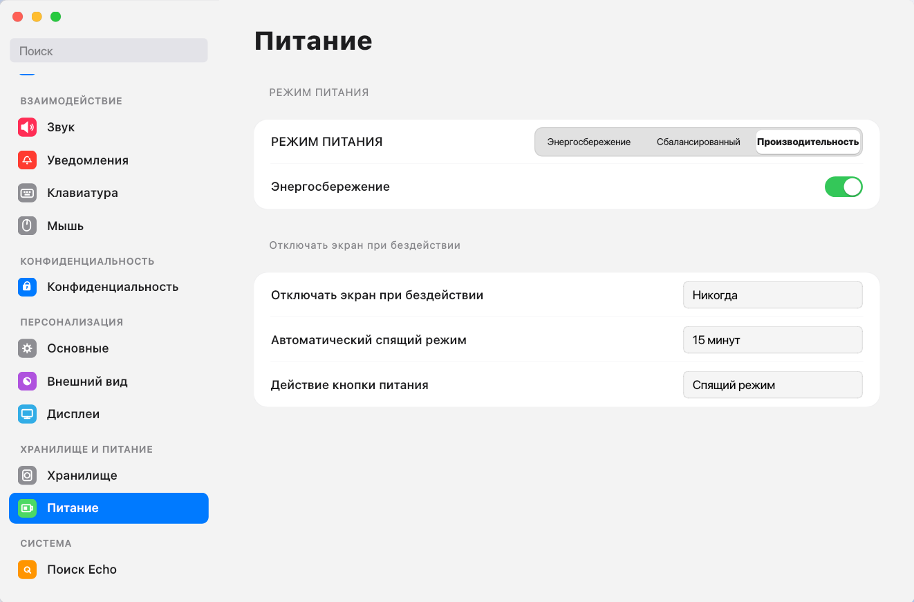 |
| **Клавиатура и ввод** | **Мышь и тачпад** |
| 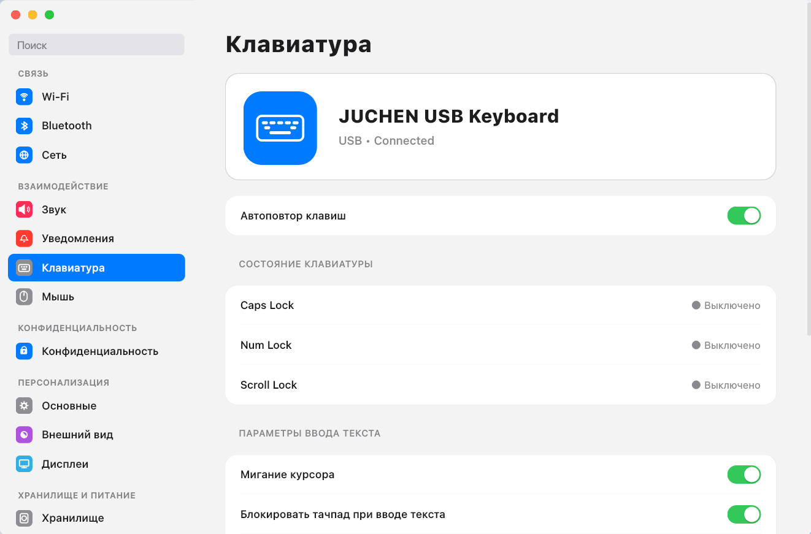 | 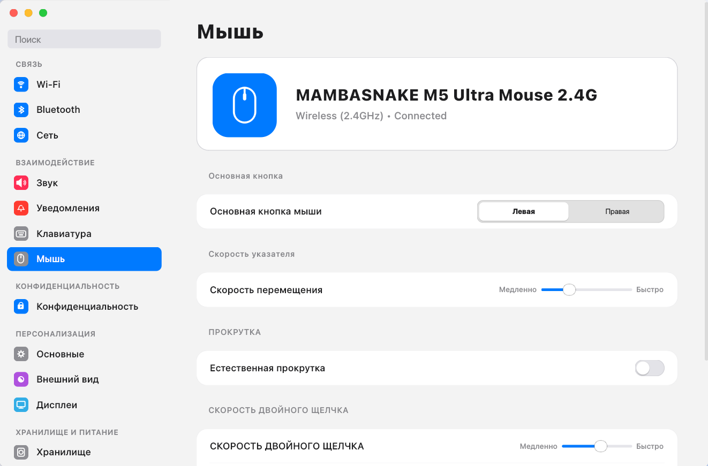 |
| **Конфиденциальность и доступ** | **Интеграция с Echo Search** |
| 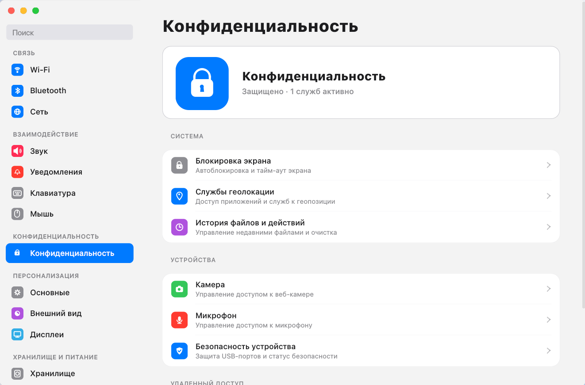 | 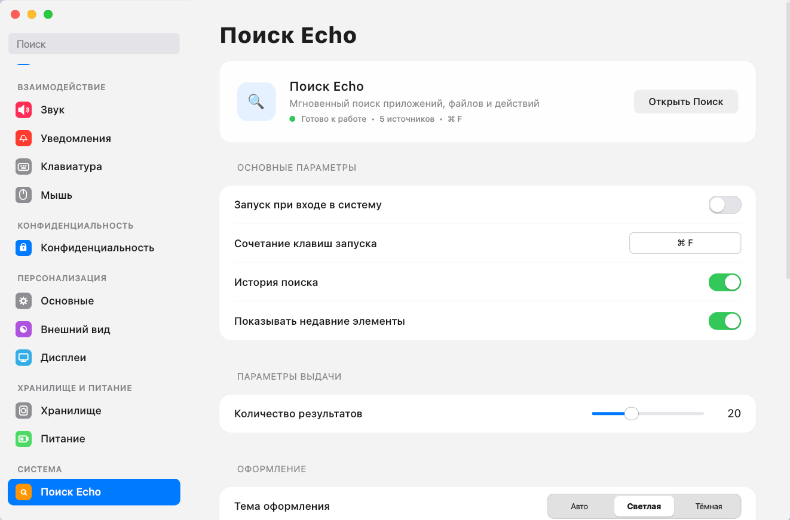 |

## Поддерживаемые языки

Echo Settings поддерживает 13 языков интерфейса:

* Русский (Russian)
* English (English)
* Español (Spanish)
* Deutsch (German)
* Français (French)
* 简体中文 (Chinese)
* 日本語 (Japanese)
* Italiano (Italian)
* Português (Portuguese)
* Türkçe (Turkish)
* Українська (Ukrainian)
* Қазақша (Kazakh)
* العربية (Arabic)

## Совместимость

* **Дистрибутивы**: протестировано на PikaOS, Debian 13, Ubuntu 22.04+ и Linux Mint. Поддерживаются другие дистрибутивы Linux при наличии необходимых зависимостей.
* **Графические окружения**: оптимизировано для GNOME и Cinnamon. Поддерживает работу в сессиях Wayland и X11.

## Установка

> **Рекомендуемый способ:** Настоятельно рекомендуется использовать **Универсальный установщик** (`install.sh`). Он автоматически определяет ваш дистрибутив, ставит необходимые библиотеки и корректно регистрирует приложение в системе.

### 1. Универсальный установщик (Рекомендуется)
Скрипт проверяет зависимости, копирует файлы программы, регистрирует иконку и создает `.desktop` файл:

```bash
git clone https://github.com/dezaetterg/echo-settings.git
cd echo-settings
chmod +x install.sh
./install.sh
```

### 2. Пакет для Debian / Ubuntu / Linux Mint (.deb)
Готовый `.deb` пакет можно загрузить со страницы [Releases](https://github.com/dezaetterg/echo-settings/releases):

```bash
# Если файл скачан через браузер:
sudo apt install ~/Загрузки/echo-settings_*.deb || sudo apt install ~/Downloads/echo-settings_*.deb

# Либо установка скачанного файла в текущей папке:
sudo apt install ./echo-settings_1.0.4_amd64.deb
```

### 3. Arch Linux / Manjaro (PKGBUILD)
Сборка и установка через `makepkg`:

```bash
git clone https://github.com/dezaetterg/echo-settings.git
cd echo-settings
makepkg -si
```

### 4. Fedora / openSUSE / RHEL
Установка через универсальный установщик:

```bash
git clone https://github.com/dezaetterg/echo-settings.git
cd echo-settings
chmod +x install.sh
./install.sh
```

### 5. Сборка deb-пакета из исходников
```bash
git clone https://github.com/dezaetterg/echo-settings.git
cd echo-settings
./build_deb.sh
```

### 6. Запуск из исходного кода
```bash
git clone https://github.com/dezaetterg/echo-settings.git
cd echo-settings
pip install -r requirements.txt
python3 main.py
```

### Установка зависимостей в Ubuntu / Linux Mint
Если пакеты PySide6 отсутствуют в базовых репозиториях:

```bash
sudo add-apt-repository universe
sudo apt update
sudo apt install python3-pyside6.qtcore python3-pyside6.qtgui python3-pyside6.qtwidgets
```

## Навигация

* Поиск в боковой панели фильтрует нужные разделы настроек по ключевым словам на русском и английском языках.
* Клавиша `Esc` очищает строку поиска.

## Системное взаимодействие (D-Bus)

Приложение взаимодействует с системными службами через стандартные интерфейсы D-Bus:
* **GSettings / dconf**: темы оформления, параметры интерфейса, таймауты сна.
* **NetworkManager**: сканирование и подключение к беспроводным сетям.
* **UPower**: уровень заряда аккумулятора и профили питания.
* **PipeWire / PulseAudio**: управление аудиопотоками и устройствами.
* **Mutter DisplayConfig**: изменение разрешений и геометрии мониторов в сессиях Wayland.

## Зависимости

* Python 3.10+
* PySide6 (Qt 6.5+)
* psutil
* dbus-next / jeepney

## Лицензия

GNU General Public License v3.0 (GPLv3). Подробнее в файле [LICENSE](LICENSE).

Автор: **[@dezaetterg](https://github.com/dezaetterg)**
